# Behavioral Cloning

## Model Architecture

    ____________________________________________________________________________________________________
    Layer (type)                     Output Shape          Param #     Connected to                     
    ====================================================================================================
    convolution2d_1 (Convolution2D)  (None, 33, 100, 24)   1824        convolution2d_input_1[0][0]      
    ____________________________________________________________________________________________________
    elu_1 (ELU)                      (None, 33, 100, 24)   0           convolution2d_1[0][0]            
    ____________________________________________________________________________________________________
    convolution2d_2 (Convolution2D)  (None, 17, 50, 36)    21636       elu_1[0][0]                      
    ____________________________________________________________________________________________________
    elu_2 (ELU)                      (None, 17, 50, 36)    0           convolution2d_2[0][0]            
    ____________________________________________________________________________________________________
    convolution2d_3 (Convolution2D)  (None, 7, 23, 48)     43248       elu_2[0][0]                      
    ____________________________________________________________________________________________________
    elu_3 (ELU)                      (None, 7, 23, 48)     0           convolution2d_3[0][0]            
    ____________________________________________________________________________________________________
    convolution2d_4 (Convolution2D)  (None, 5, 21, 64)     27712       elu_3[0][0]                      
    ____________________________________________________________________________________________________
    elu_4 (ELU)                      (None, 5, 21, 64)     0           convolution2d_4[0][0]            
    ____________________________________________________________________________________________________
    convolution2d_5 (Convolution2D)  (None, 3, 19, 64)     36928       elu_4[0][0]                      
    ____________________________________________________________________________________________________
    elu_5 (ELU)                      (None, 3, 19, 64)     0           convolution2d_5[0][0]            
    ____________________________________________________________________________________________________
    flatten_1 (Flatten)              (None, 3648)          0           elu_5[0][0]                      
    ____________________________________________________________________________________________________
    dense_1 (Dense)                  (None, 100)           364900      flatten_1[0][0]                  
    ____________________________________________________________________________________________________
    elu_6 (ELU)                      (None, 100)           0           dense_1[0][0]                    
    ____________________________________________________________________________________________________
    dense_2 (Dense)                  (None, 50)            5050        elu_6[0][0]                      
    ____________________________________________________________________________________________________
    elu_7 (ELU)                      (None, 50)            0           dense_2[0][0]                    
    ____________________________________________________________________________________________________
    dense_3 (Dense)                  (None, 10)            510         elu_7[0][0]                      
    ____________________________________________________________________________________________________
    elu_8 (ELU)                      (None, 10)            0           dense_3[0][0]                    
    ____________________________________________________________________________________________________
    dense_4 (Dense)                  (None, 1)             11          elu_8[0][0]                      
    ====================================================================================================
    Total params: 501,819
    Trainable params: 501,819
    Non-trainable params: 0
    ____________________________________________________________________________________________________

    ====================================================================================================
    Total params: 501,819
    Trainable params: 501,819
    Non-trainable params: 0
    ____________________________________________________________________________________________________

## Normalization
* Input image is assumed to be RGB
* Crop 1/5th off top and 25px off bottom
* Image converted to YCbCr color space
* Scaled down to 200x66
* Pixel values converted from uint8 (0 - 255) range to float32 (-1.0 to +1.0) range

## Training data pre-processing
* Majority of the training data contains steering angles that are close to 0. To reduce the disparity, 75% of the rows with low steering values are removed.
* Round steering values to 2 decimal places. Each steering angle is one of 200 values in range -1 to +1 (steps of 0.01)
So problem is simplified and could even be treated as a classification problem with 200 classes.
* Training data is shuffled after each epoch
* 

### Data Augmentation

 NumSamples: 74992, Shape:(1, 66, 200, 3)

Center camera image:

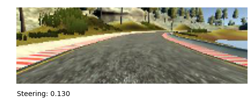

Left camera image:

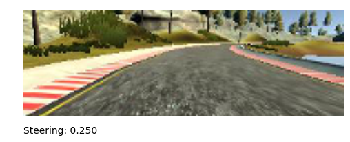

Right camera image:

Random shadow added to center image:

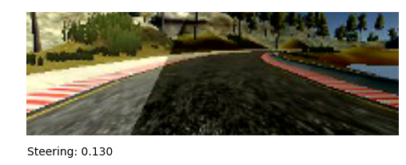

Random shadow added to left image:

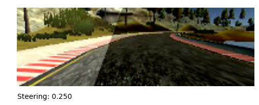

Random shadow added to right image:

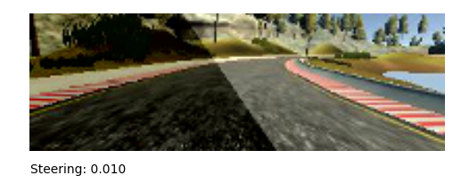

Random horizontal shift added to center image:

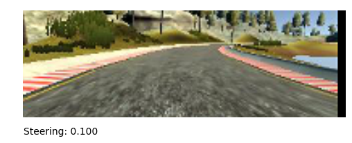

Random horizontal shift added to left image:

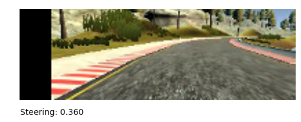

Random horizontal shift added to left image:

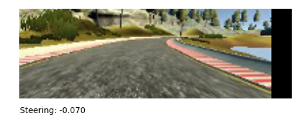

Image flipped horizontally:

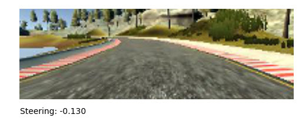

Center image dimmed:

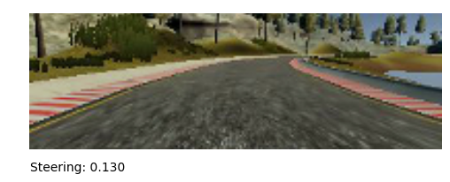

Center image brightened:

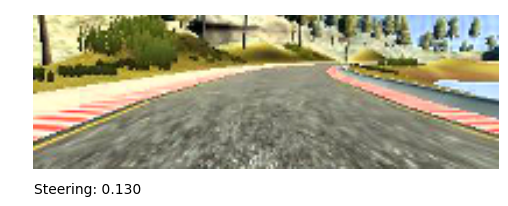

Left image dimmed:

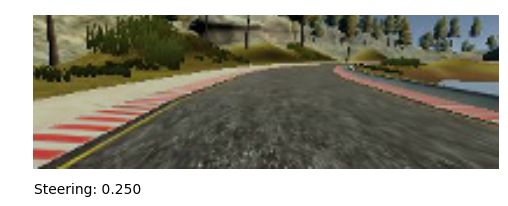

Left image brightened:

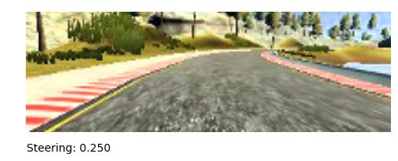

Right image dimmed:

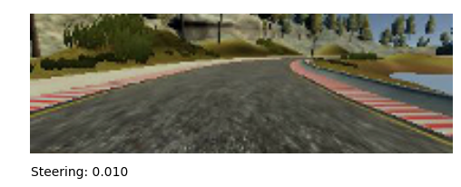

Right image brightened:

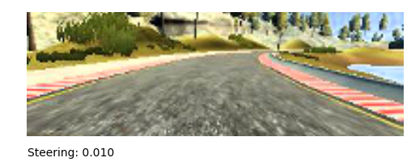

## Live Trainer

