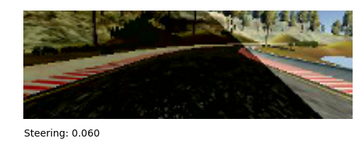

# Behavioral Cloning

## Model Architecture

| Layer and Type | Output Size | Params|
|----------------|-------------|-------|
|Normalization Layer| 200x66x3 | |
|Convolution 1 | 200x66x3 | 1824 |
|ELU | | |
|Dropout| | 0.25|
|Convolution 2| 50, 17, 36 | 21636 |
|ELU | | |
|Dropout| | 0.25|
|Convolution 3| 23, 7, 48 | 43248 |
|ELU | | |
|Dropout| | 0.5|
|Convolution 4| 21, 5, 64 | 27712 |
|ELU | | |
|Dropout| | 0.5|
|Convolution 5| 19, 3, 64 | 36928 |
|ELU | | |
|Dropout| | 0.5|
|Flatten | 3648| |
|Fully Connected 1| 100 | 364900 |
|ELU | | |
|Dropout| | 0.5|
|Fully Connected 2| 50 | 5050 |
|ELU | | |
|Dropout| | 0.5|
|Fully Connected 3| 10 | 510 |
|ELU | | |
|Fully Connected 4| 1 | 11 |

I tried a few different architectures before settling on the NVIDIA model detailed in the [Apr.2016 paper titled "End to End Learning for Self-Driving Cars"](http://images.nvidia.com/content/tegra/automotive/images/2016/solutions/pdf/end-to-end-dl-using-px.pdf).

After implementing a model that matched NVIDIA team's description (layers and number of trainable parameters), I experimented with (i) color spaces, (ii) image augmentation, (iii) adjusting model and training parameters, (iv) normalization and (v) live-training to try and achieve these two goals:
* Car should sucessfully navigate track 1.
* Car should drive with stability and not sway from side to side.

## Normalization
* The following transforms are peformed on (i) training, (ii) validation data sets and (iii) test data coming from the simulator.

#### Reading Images
* Input image read from disk are always converted to RGB format.

#### Cropping
* Crop 1/5th off top and 25px off bottom to eliminate most of the sky and car's hood. This lets the model train on what is most important - the road.

#### Color space
* Image converted to YCbCr color space where Y is the grayscale copy of the image and Cb,Cr contain the color information.
* From tests, it became clear that training on YCbCr did not have a significant benefit over RGB.
* Keeping the image in YCbCr space made it easier to experiment with training on the Y channel alone.

#### Scaling
* Images are scaled down to 200x66 to reduce the overall size of the model. This allows it to train faster and use less memory.
* The exact numbers (200x66) were chosen to match the NVIDIA model.

#### Pixel value normalization
* Pixel values are converted from uint8 (0 - 255) range to float32 (-1.0 to +1.0) range.
* This step is implemented in the model as the first layer so we can take advantage of faster execution on the GPU.

#### Steering value normalization
* Round steering values to 2 decimal places.
* Each steering angle is one of 200 values in range -1 to +1 (steps of 0.01).
* This simplifies the problem and could even be treated as a classification problem with 200 classes.

## Data Augmentation
* Udacity supplied a data set with 8006 samples, each containing 3 images.
* A majority of the training data contains steering angles that are close to 0. To reduce the disparity and help the model learn when to turn, 75% of the rows with low steering values are removed.
* What is left is woefully inadequate to train a deep model such as the NVIDIA model.

* The goal of augmenting the data set is to train the model on a wider range of scenarios, helping it to generalize well.
* Simple image transforms implemented as python generators can be used to multiply the data set considerably.
* In all, the augmentation methods below yielded 45 images per sample in the udacity data set.

#### Using left and right camera images
* Every training data sample contains images from 3 cameras: left, center and right along with a steering value (y).
* The left and right images can be used as center images by adjusting the steering values: adding adjustment for the left image and subtracting the adjustment value for the right image.
* I experimented with several values for the steering adustment between 0.25 and 0.04.
* Models trained with a high adjustment value tended to turn sharply causing the car to zig-zag even on a straight stretch of road.
* Models training with a low adjustment value (like .04) resulted in models that could not turn fast enough on sharp curves.
* Through trial and error, I found that 0.1 was a good value to use.
* All subsequent augmentations are performed on all three images.
* Another simple method to generate training data is to horizontally flip each image and negating the steering value. This would yield and additional three images to train on.

|Left camera image | Center camera image | Right camera image |
|------------------|---------------------|--------------------|
||||

#### Random image shifting
* Another method to generate additional data is to randomly shift each image (under 1/5 th of the width) and proportionally adjust the steering value.

|Source | Shift Vertical | Shift Horizontal | Horizontal Flip |
|-------|----------------|------------------|-----------------|
|Center camera||||
|Left camera||||
|Right camera||||

#### Brightness adjustment
* To reduce sensitivity to scene brightness (presumably sunny vs gloomy skies), we add copies of image data with brightness reduced by a factor. Since the data set is bright to begin with, we only reduce brightness, not increase it.

|Source | 75% | 50% | 25% |
|-------|------|------|-------|
|Center camera||||
|Left camera||||
|Right camera||||

#### Synthetic shadows
* On track 1, the car encounters shadows of trees, power lines and boulders.
* To train the model to ignore shadows, we add random shadows to training data.

|Source |  Shadow 1    |  Shadow 2 |
|-------|--------------|-----------|
|Center camera|||
|Left camera|||
|Right camera|||

#### Combination of shift and shadows
* To vary the shadows further, we combine shifting and shadow generation resulting in 18 more images

|Source |Shadow 1 + Vertical|Shadow 1 + Horizontal|Shadow 1 + Flip|Shadow 2 + Vertical|Shadow 2 + Horizontal|Shadow 2 + Flip|
|-------|-------------------|---------------------|---------------|-------------------|---------------------|---------------|
|Center camera|||||||
|Left camera|||||||
|Right camera|||||||

## Training
* Training is implemented using the Keras framework, specifically the `fit_genrator` method that uses data from generators to train the model.
* `fit_generator` includes support for multiprocessing so that image augmentmentation can be run in parallel to GPU operations performed by the tensorflow backend.
* Utilizing this function was necessary to speed up data augmentation and training the model.
* This ensures the 8 cores on the CPU and the GPU were fully utilized.

### Multiprocessing
* Training data is shuffled and divided into 8 sets that are fed into a multiprocessing queue.
* Keras `fit_generator` was set to spawn and run 8 subprocesses of the data generator.
* Each data generator instance would pop one data set from the multiprocessing queue and use it as its source of images and begin generating augmented images from it. After the end of the epoch, each generator would shuffle its dataset.

### Data Validation and Analysis
* To understand how the model performed, I split the data set into test and validation sets so I could compare the loss values over 25 epochs.
* Visualizing the performance helped choose:
- Dropouts
- Image color space
- Model size
- Training hyperparameters
- Selecting activation layer (RELU vs ELU)

* Note clear separation between training and validation loss values indicating overfitting.
.png)

* Note ELU leads to softer loss curve
.png)

* Note better performance on validation data even if the absolute loss value is larger than when no dropout is used.

##### Training on Grayscale data
* Models trained on color images out performed models trained with grayscale images.
* This maybe because they can distinguish better between shadows on the road and edges of lanes.
* Models trained on grayscale data often confused lane edges on sharp curves with shadows and drove right out of the road and on to the dirt and continued following the dirt road just fine.
* Since Track 1 is simpler, the model performed fairly well even when trained with grayscale images.

##### Experimenting with Dropout
* I tried the following options with dropouts:
  - NVIDIA model with no Dropout layers
  - NVIDIA model with Dropout layers only on the fully-connected layers
  - Dropout applied to all layers, including convolutional
  - Varying the amount of Dropout values

* After several tests, it became clear that when the augmented data set is large, dropout layers are essential to preventing overfitting.
* The best results came from applying dropouts to all layers including convolutional layers.
* The amount of dropout was capped at 0.5 (keep 50% of values).
* On shallower convolutional layers (such as the first two), the dropout was reduced to 0.25 (keep 25% of values).
* This was 

##### Adjusting NVIDIA architecture
* Number of variables same as NVIDIA model (250000)
* border-mode "Valid" and "Same"
* Same: Trainable params: 270,219
* Switching Conv. 3,4 and 5 to use "Valid" mode almost doubled the number of trainable params to 501,819. Models using this mode trained better with lower loss values, but was prone to overfitting, requiring the addition of dropout layers.

## Live Trainer
* After training the model with above augmentation, it performed quite well "out-of-the-box" at lower speeds (20mph). The car could comfortably do several laps without error.

* But when running the model at the top speed of 30mph, it veers too close to the edge of curved sections of road.
* To teach the model how to handle curves at higher speed, it requires additional data especially around the curved sections of road.

* To accomplish this, I implementd live training a method documented by "".

* `Drive.py` was modified to implement live training as shown below:

##### Starting up
* The Udacity simulator is fired up in simulation mode.
* `predict-train.py` and `drive.py` are started in terminal windows.
* `drive` has a UI window that accepts key presses tha control the system.
  - **Up/Down**: increase or decrease car's speed (between 0 and 30)
  - **Left/Right** to make a turn manually (instead of predicting from the model) and cache the image and manual steering value for training later.
  - **T (train)**: train model with cached data and commit to disk. This could take time, so do this when the car is on a straight stretch and not requiring manual override.
  - **S (scratch it)**: discard cached data - useful when the manual turn was not good and should be discarded.
  - **Q**: Exit app.

##### Predicting
* The simulator would always request `drive` for steering and throttle values.
* Normally, `drive` forwards the request to `predict-train` with the command 'predict'.
* `predict-train` would call Keras' Squential `predict` function to generate the steering angle based on the image.
* `drive` would adjust the throttle to keep the cars speed around the user specified value.

##### Training 
* When the car needs additional data at some point in the track, we can provide manual input by pressing the Left/Right keys.
* When a request for steering values comes in from the simulator, `drive` would supply the user provided steering input instead of making a prediction with the model. The new steering value is calculate by adusting current steering by a predefined 'turn-amount' based on the key pressed.
* `drive`will also send the current image and computed steering to `predict-train`
* `predict-train` will cache the image-steering set in memory.
* After manual input is done, press 'T' in `drive` to signal `predict-train` to update the model with data in its cache. This is done using the Keras Squential `fit` method. After model is fitted, it is persisted to disk and the cache is cleared.

Driving a few laps and training an additional 100 samples corrected the model enough to be able to drive around the first track all night long without crashing.

### Video of Car on Track 1

This video shows my environment with `drive`, `predict-train` and the simulator running.

## References

[Live Trainer by Thomas Antony](https://medium.com/@tantony/training-a-neural-network-in-real-time-to-control-a-self-driving-car-9ee5654978b7)

[Augmenting NVIDIA's CNN by Vivek Yadav](https://chatbotslife.com/learning-human-driving-behavior-using-nvidias-neural-network-model-and-image-augmentation-80399360efee)

## Future

* Explore grayscale based models further
* Explore [Grand Theft Auto V simulated world](https://openai.com/blog/GTA-V-plus-Universe/)

